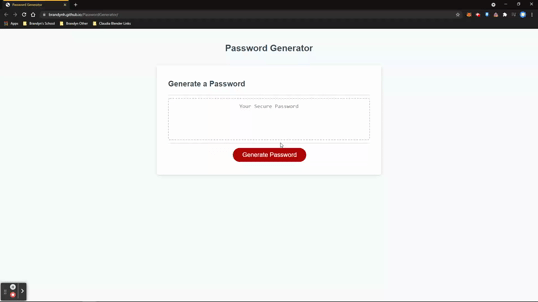
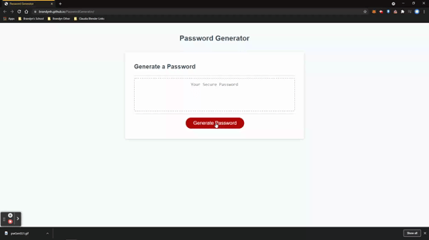

# PasswordGenerator

## Description
Welcome! This page will create a randomly generated password with user defined criteria! 

## Installation
This neat device is built in right [here!](https://brandynh.github.io/PasswordGenerator/)

## Screenshots

 

## Credits 
    
By : Brandyn Huffer

### References

* [W3Schools](https://www.w3schools.com/js/default.asp)
* [BootCamp Markup Guide](https://coding-boot-camp.github.io/full-stack/github/professional-readme-guide)
* [Mozilla MDN](https://developer.mozilla.org/en-US/docs/Learn/JavaScript)
* [Stack Overflow](https://stackoverflow.com/questions/1497481/javascript-password-generator)
